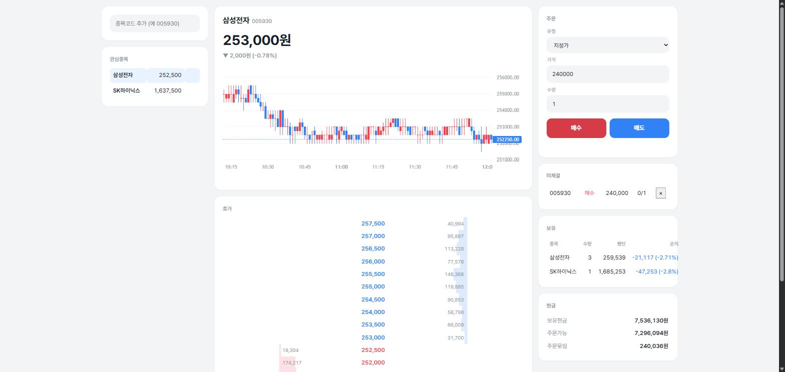
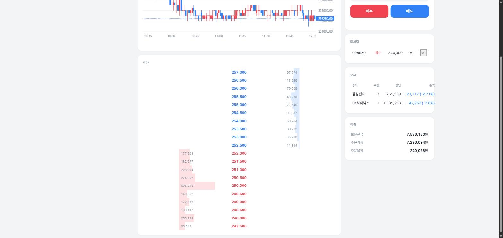

# toss

토스증권 OpenAPI로 만든 국내 주식 **모의투자 + 전략 백테스팅** 프로젝트.

실시간 시세를 받아 가짜 돈으로 매매하고, 56개 전략을 과거 데이터로 검증하고,
검증한 전략을 실시간으로 돌려 신호가 나면 화면에 알린다. **실매매 코드는 없다.**

> **왜 이렇게 생겼는지**는 [docs/ARCHITECTURE.md](docs/ARCHITECTURE.md)에 있다.
> 프로세스를 둘로 나눈 이유, 둘이 주고받는 계약, 넘지 않는 선이 적혀 있다.
> 코드를 고치기 전에 읽으면 같은 함정을 두 번 파지 않는다.




---

## 구조

두 덩어리로 나뉜다. **같은 것의 두 언어 버전이 아니라 역할이 다르다.**

```
toss/
├── .env                시크릿 (양쪽이 공유, gitignore)
├── market_data.db      캔들 저장소 (gitignore — 직접 수집해야 한다)
├── docs/
│   └── ARCHITECTURE.md 설계 문서
│
├── server/             Kotlin + Spring Boot  ── 실시간 게이트웨이
│   └── :8080           토스 웹소켓을 물고, 재연결하고, 팬아웃한다
│
└── research/           Python  ── 리서치
    ├── :8000           전략 · 백테스트 · 캔들 수집 · 모의투자 웹앱
    └── CLAUDE.md       파이썬 쪽 세부 규칙과 함정
```

| | server (Kotlin) | research (Python) |
|---|---|---|
| 맡은 일 | 연결 유지, 상태 보관, 전달, 검증 | 전략 계산, 검증, 데이터 수집 |
| 중요한 것 | **안 죽는 것** | **정답을 내는 것** |
| 강점 | 롱러닝, 스레드, 타입 안정성 | pandas/numpy, 빠른 반복 |

리서치를 파이썬으로 하고 실행을 JVM에 두는 건 실제 트레이딩 회사의 표준 분업이다.
전략 56개와 `indicators.py`가 이미 파이썬에 있고, 그걸 Kotlin으로 옮겨도 얻는 게 없다
(백테스트는 pandas가 압도적이고, 지표 계산은 JVM으로 옮긴다고 빨라지지 않는다).

---

## 시작하기

### 준비물

1. [토스증권 OpenAPI](https://openapi.tossinvest.com) 앱 등록 → client id / secret 발급
2. **토스 홈페이지에서 내 IP 등록** — 이게 빠지면 토큰이 401이 아니라
   "IP 미등록"으로 실패한다. 가장 흔한 첫 삽질 지점이다.
3. 저장소 최상위에 `.env` 생성:

```dotenv
TOSS_CLIENT_ID=발급받은_client_id
TOSS_CLIENT_SECRET=발급받은_client_secret
```

`.env` 하나만 최상위에 두는 이유: `.gitignore`에 그 파일 하나만 걸면 양쪽이 다 안전하다.
Kotlin은 `auth/EnvFile.kt`가 실행 위치에서 위로 거슬러 올라가며 찾고,
파이썬은 `data/auth.py`가 `python-dotenv`로 읽는다. 토큰은 양쪽 다 자동 발급·캐시한다
(만료 60초 전 갱신).

### 4. 캔들 수집 — 백테스트 전에 반드시

**`market_data.db`는 저장소에 없다.** 용량 때문에 `.gitignore` 대상이라 새 환경에서는
직접 받아야 한다. 이게 없으면 백테스트는 빈 데이터로 돌고, 시그널 러너는
"워밍업 0봉" 경고를 찍으며 지표가 시드에 끌려다닌다.

```bash
cd research
python -m data.candles --kospi50 --interval 1d    # 먼저 이것부터. 몇 분이면 끝난다
python -m data.candles --kospi50 --interval 1m    # 1시간 이상 걸린다
```

**일봉을 먼저 받는 것을 권한다.** 1975년까지 올라가고, 전략 검증의 검정력은 거의 전부
일봉에서 나온다. 1분봉은 종목당 거래일이 28일뿐이라 검정력이 약하다.

### 파이썬

```bash
pip install fastapi uvicorn websockets requests pandas numpy python-dotenv matplotlib
```

`requirements.txt`는 없다. 빌드·린트 파이프라인도 없다.

### Kotlin

**JDK 25**가 필요하다 (`build.gradle.kts`의 `JavaLanguageVersion.of(25)`).
Gradle이 없으면 알아서 받아 두지만, `JAVA_HOME`이 환경변수에 없으면 래퍼가 못 돈다:

```bash
export JAVA_HOME="$HOME/.gradle/jdks/eclipse_adoptium-25-amd64-windows.2"   # 예시
```

---

## 쓰는 법 — 세 갈래

### 1. 모의투자 웹앱 (파이썬 단독)

```bash
cd research
python -m uvicorn paper.app:app --reload     # http://localhost:8000
```

브라우저에서 손으로 주문을 넣고, 체결·잔고·손익을 가짜 돈으로 추적한다.
체결 엔진이 이 프로젝트에서 가장 공들인 부분이다:

- **시장가**는 호가를 다단으로 훑고, 소진되면 부분체결로 끝난다 (대기하지 않는다)
- **지정가**는 `pending`으로 남았다가 체결 프린트가 지정가를 지나갈 때 채워진다.
  체결가는 내 지정가가 아니라 **실제로 프린트된 가격**이다
- **수수료를 예약금액에 포함**해서 계산한다. 이걸 빼먹으면 현금을 정확히 다 쓰는
  주문이 검증을 통과하고 잔고를 마이너스로 만든다
- 상태를 따로 저장하지 않고 **`fills` 테이블에서 파생**한다. 현금·보유수량·평균단가를
  중복 저장하면 언젠가 어긋나고, 어긋난 잔고는 조용히 틀린다

큐 포지션은 모델링하지 않아서 실제보다 잘 체결된다.

### 2. 실시간 호가 + 지정가 매매 (Kotlin 단독)

```bash
cd server
./gradlew bootRun                             # http://localhost:8080/orderbook
```

토스 실시간 호가를 받아 화면에 뿌리고, H2에 모의 주문을 넣는다.
파이썬 쪽과 별개의 모의투자다 (이쪽은 Spring 연습 목적으로 더 단순하다).

### 3. 시그널 파이프라인 (Kotlin + 파이썬)

전략을 실시간으로 돌려 신호가 나면 브라우저에 배너를 띄운다. **터미널 두 개.**

```bash
# 터미널 1 — 게이트웨이
cd server && ./gradlew bootRun

# 터미널 2 — 전략 러너
cd research && python -m paper.signal_runner EmaCrossStrategy --ticker 005930
```

```
            토스 서버
               │ WebSocket 1개뿐
               ▼
    ┌──────────────────────┐
    │ server  :8080        │
    │  TossFeedClient      │
    │   ├ 호가 → /ws        │
    │   └ 체결 → /ws        │
    │                      │
    │  SignalController    │◀──── POST /api/signals ────┐
    │   └ 시그널 → /ws      │                           │
    └──────────┬───────────┘                           │
               │ ws://localhost:8080/ws                │
               ├────────────────────▶ 브라우저          │
               │                                       │
               └────────────────────▶ signal_runner ───┘
                                      (구독 + 발신)
```

**파이썬 러너는 서버가 아니다.** 포트를 열지 않는다. 나가는 연결 두 개
(웹소켓 구독, HTTP POST)가 전부다.

**왜 파이썬이 토스에 직접 안 붙나:** 토스 업스트림 웹소켓은 **계정당 2개 제한**이다.
양쪽이 각자 붙으면 한도를 다 써서 모의투자 웹앱을 같이 띄울 자리가 없다.
그래서 토스에 붙는 건 Kotlin 하나로 두고, 파이썬은 Kotlin의 `/ws`를 구독한다.
덕분에 러너는 실시간 경로에 토스 토큰이 아예 필요 없다
(과거 캔들 워밍업에는 여전히 필요하다 — 그건 REST라서 연결 수와 무관하다).

러너 옵션:

```bash
python -m paper.signal_runner RsiReversionStrategy --ticker 005930 000660 --warmup 500
python -m paper.signal_runner EmaCrossStrategy --ticker 005930 --server localhost:8080
```

| 옵션 | 기본값 | 설명 |
|---|---|---|
| `strategy` | (필수) | 전략 클래스 이름. `REGISTRY`에 있는 것 |
| `--ticker` | (필수) | 종목코드, 여러 개 가능 |
| `--warmup` | 300 | 앞에 붙일 과거 분봉 수. 0이면 워밍업 없음 |
| `--server` | localhost:8080 | Kotlin 서버 host:port |

**워밍업이 왜 필요한가:** 전략의 EMA/rolling은 초기값이 시드에 끌려다닌다.
과거 봉을 앞에 붙이면 첫 실시간 봉부터 백테스트와 **같은 지표값** 위에서 판단한다.
워밍업이 전략이 요구하는 구간보다 짧으면 WARNING을 찍는다 —
조용히 신호가 안 나는 상태가 가장 알아채기 어려운 실패다.

---

## 백테스팅

```bash
cd research

python -m backtest.run EmaCrossStrategy --ticker 005930                   # 단일
python -m backtest.run EmaCrossStrategy --ticker 005930 --optimize --plot --daily
python -m backtest.run EmaCrossStrategy --ticker 005930 --full            # 전 구간 (in-sample)
python -m backtest.run --all --ticker 005930 000660                       # 전략 × 종목 순위표
python -m backtest.run Alpha006Strategy --ticker 005930 --interval 1d     # 정식 알파는 일봉으로

python -m backtest.results                    # 전 전략 × KOSPI50 증분 평가 + 리포트
python -m backtest.results --report-only      # 계산 없이 캐시로 리포트만
python -m backtest.results --selfcheck        # 증분 = 전량 재계산인지 검증
```

`--optimize`는 `backtest/grids.py`의 탐색 범위로 train 구간 그리드서치를 돌린 뒤,
그 파라미터를 test 구간에 적용해 **out-of-sample**로 보고한다.
기본이 walk-forward이고 `--full`을 줘야 전 구간 in-sample이 된다 —
in-sample 수치를 실력으로 착각하지 않기 위한 기본값이다.

### 전략 56개

| 분류 | 개수 | 예시 |
|---|---|---|
| `trend_following/` | 14 | EMA 크로스, MACD, Supertrend, Ichimoku, ADX/DI |
| `mean_reversion/` | 13 | 볼린저, RSI, Connors RSI2, Z-score, VWAP 회귀 |
| `session_based/` | 9 | 갭 필, 오프닝 레인지 돌파, 피벗, 변동성 돌파 |
| `momentum/` | 7 | MFI, OBV, CMF, Force Index, 거래량 돌파 |
| `formulaic/` | 5 | WorldQuant 101 Alphas 중 5개 (일봉 전용) |
| `microstructure/` | 5 | Roll 스프레드, 주문흐름 불균형, Amihud 비유동성 |
| `volatility/` | 3 | ATR 채널 돌파, 볼린저 스퀴즈, NR7 |

전략은 `strategies/__init__.py`가 하위 패키지를 훑어 `REGISTRY`에 자동 등록한다.
새 전략을 추가하려면 파일만 놓으면 된다 — 등록 코드를 고칠 필요가 없다.
대신 **문법 오류가 있는 파일 하나가 `REGISTRY` 전체를 깨뜨린다.**

---

## 데이터 수집

```bash
cd research

python -m data.candles 005930 000660 --interval 1m   # 지정 종목 (증분)
python -m data.candles --kospi50 --check             # 종목코드 유효성만 확인
python -m data.candles --kospi50 --interval 1m       # 50종목 전량 (1시간 이상)
python -m data.candles --kospi50 --interval 1d       # 일봉 (몇 분이면 끝난다)
```

`market_data.db` (SQLite, gitignore). 테이블 `candles`, PK `(ticker, timeframe, timestamp)`.
`INSERT OR IGNORE` 증분이라 **재실행해도 안전하다.**

**저장소에는 이 파일이 없다.** 클론한 직후에는 위 명령으로 직접 받아야 한다.
데이터를 커밋하지 않는 정책이라 그렇고, 백업도 없다 — 한 번 날리면 다시 받는 수밖에 없다.

> **토스 API가 429를 자주 던진다.** 실측으로 50종목 중 17종목이 rate limit으로
> 실패했다. `update_multiple`에 재시도가 없어서 한 번에 다 못 받는다.
> 수집이 증분이니 실패한 종목만 다시 돌리면 된다.

**1분봉은 종목당 거래일이 28일뿐이고, 일봉은 1975년까지 올라간다.**
전략 검증의 검정력은 거의 전부 일봉에서 나온다.

---

## 디렉토리 상세

```
server/                                 Kotlin, Spring Boot
└── src/main/kotlin/com/example/demo/
    ├── feed/       760줄  토스 웹소켓: 파싱, 재연결(지수 백오프), PING, 팬아웃
    ├── trade/      262줄  모의 주문·체결·보유 (H2)
    ├── signal/     205줄  파이썬 신호 수신 + 브라우저 푸시
    ├── auth/       157줄  .env 파싱, 토큰 자동 발급·갱신
    ├── quote/       87줄  호가 REST
    └── price/       49줄  현재가 REST

research/                               Python
├── paper/          모의투자 웹앱 + 시그널 러너
│   ├── app.py          FastAPI: REST + /ws 팬아웃 + 정적 페이지
│   ├── broker.py       체결 엔진 · 포트폴리오 (paper.db)
│   ├── feed.py         토스 웹소켓 (app.py 전용)
│   ├── toss.py         읽기 전용 REST 래퍼
│   ├── ticks.py        KRX 호가단위 표
│   ├── signal_runner.py  전략을 실시간으로 돌려 server로 신호 발신
│   ├── static/index.html 화면 전부 (빌드 없음)
│   └── tests/
├── strategies/     전략 56개 + indicators.py (paper·backtest가 공유)
├── backtest/       engine, metrics, optimize, validation, report, grids, run, results
├── data/           candles.py(수집·조회) auth.py(토큰) tickers.py
└── CLAUDE.md       설계 제약과 함정이 자세히 적혀 있다
```

`strategies/`와 `data/`가 `paper/`·`backtest/` 바깥에 있는 이유: 전략을 골라
자동매매를 붙일 때 `paper/`가 `backtest/`를 거치지 않고 전략을 직접 import할 수
있어야 한다. **`paper/`는 `backtest/`를 import하지 않는다** — 이 방향은 뒤집지 않는다.

**모든 파이썬 명령은 `research/`에서 실행한다.** import가 이 디렉토리를 루트로 잡는다.

---

## 설계 제약 — 읽고 시작할 것

**토스에는 모의투자 sandbox가 없다.** 서버가 실서버 하나뿐이라 주문 API를 부르면
실제 돈이 나간다. 그래서 `paper/toss.py`는 **읽기 전용 함수만** 노출하고,
코드 어디에도 주문·계좌 경로가 등장하지 않는다. 실매매가 필요해지면 별도 결정으로
다뤄야 한다.

**업스트림 웹소켓은 계정당 2개다.** 지금 `server`가 1개를 쓴다. `paper/app.py`를
같이 띄우면 2개가 된다. 셋을 동시에 띄우면 한도 초과다.

**브라우저는 토스 웹소켓에 직접 못 붙는다.** 핸드셰이크에 `Authorization` 헤더가
필요한데 브라우저 WebSocket API는 커스텀 헤더를 못 넣고, 넣을 수 있어도 토큰이
프론트로 샌다. 그래서 백엔드가 업스트림 하나를 물고 팬아웃한다.

**정규장(09:00~15:30)에서만 동작한다.** `paper/broker.py`는 시간외 주문을 거부하고,
`signal_runner.py`는 시간외 체결을 분봉에 넣지 않는다. 시간외단일가는 10분 단위
단일가라 분봉으로 접으면 정규장 봉과 성질이 전혀 다른 데이터가 되고,
그 위에서 나온 신호는 **한 번도 검증된 적 없는 입력에 대한 출력**이다.
휴장일·조기폐장이 있어서 시간을 하드코딩하지 않고 장 구간 API를 하루 한 번 조회한다.

**업스트림이 끊기면 지정가 체결 판정이 멈춘다.** 조용히 두면 체결됐어야 할 주문이
왜 안 됐는지 알 수 없어서 화면 상단에 빨간 배너를 띄운다.
이 설계에서 가장 위험한 조용한 실패다.

**시세 루프에서 예외가 새면 안 된다.** 프레임 파싱은 절대 예외를 던지지 않고
깨진 프레임은 버린다. 예외가 웹소켓 읽기 루프 밖으로 나가면 연결이 끊기고,
재접속할 때마다 같은 자리에서 또 죽어 피드가 영영 살아나지 않는다.
같은 이유로 `signal_runner`의 전략 실행과 HTTP 전송도 예외를 삼킨다 —
Kotlin 서버가 꺼져 있어도 러너는 죽지 않고 백오프로 재연결한다.

---

## 테스트

프레임워크 없음. `assert` 기반이고 **네트워크를 타지 않는다.**

```bash
cd research
python paper/tests/test_broker.py          # 체결 엔진
python paper/tests/test_signal_runner.py   # 시그널 러너 (29건)
python paper/tests/test_ticks.py
python paper/tests/test_toss.py
python paper/tests/test_feed.py
python strategies/tests/test_session_alpha.py     # lookahead · 오버나잇 검사
python strategies/tests/test_formulaic.py         # 연산자 손계산 대조
python strategies/tests/test_microstructure.py

cd ../server && ./gradlew test             # Kotlin 18건
```

---

## 알려진 한계

- **큐 포지션을 모델링하지 않는다.** 지정가가 실제보다 잘 체결된다.
- **그날 마지막 봉이 닫히지 않는다.** `signal_runner`는 타이머 없이
  "다음 분의 첫 틱"으로 봉을 닫는다. 거래 없는 분에 빈 봉이 생기는 것보다 낫다고 봤다.
- **호가 이력이 없다.** `orderbook:kr`을 실시간으로 받지만 흘려보내고 버린다.
  `market_data.db`에는 `candles` 테이블 하나뿐이라, `strategies/microstructure/`는
  호가 데이터 없이 봉 모양으로 근사한 대용치다.
- **H2 경로가 상대경로다.** `jdbc:h2:file:./data/paper`라서 실행 위치에 따라
  DB가 갈린다. gradle로 띄우면 `server/data/`에 생긴다.
- **`backtest.results`를 일봉으로 돌리면 안 된다.** 캐시 단위가 '거래일'이라
  일봉에서는 행 하나가 봉 하나다. 분봉 대비 약 230배가 된다.
- **수집 재시도가 없다.** 429가 나면 그 종목은 그냥 실패한다.
- **`signal_runner`가 `paper/toss.py`에 의존한다.** 정규장 필터가 `get_session()`을
  재사용하면서 생겼다. 장 구간은 시장 메타데이터라 원래는 `data/`에 있는 게 맞다.
- **모의투자가 둘이다.** Kotlin `trade/`(262줄)와 파이썬 `paper/`(1,680줄)가 겹친다.
  파이썬 쪽이 훨씬 정교하고, Kotlin 쪽은 Spring 연습 결과물이다. 합칠지 미정.

---

## 라이선스 / 면책

개인 학습용 프로젝트다. 이 코드로 인한 투자 손실에 책임지지 않는다.
실매매에 쓰지 말 것 — 애초에 실매매 코드가 없고, 넣어서도 안 된다.
